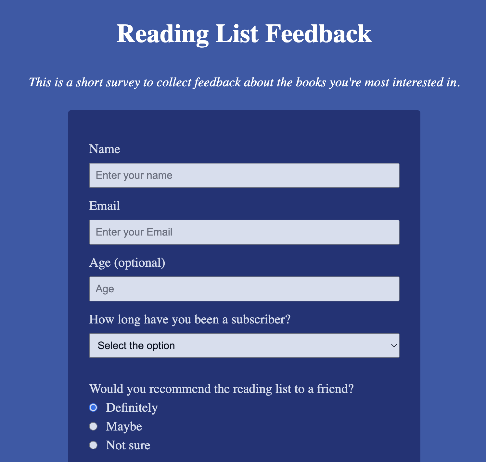

# Survey Form

This is a simple survey form designed to collect feedback on reading lists and user preferences. It includes various input types, such as text fields, radio buttons, checkboxes, a select dropdown, and a textarea. The form also demonstrates basic form validation and accessibility considerations.

---

## Features

- **User Input Fields**:
  - Name (Text input)
  - Email (Email input)
  - Age (Optional, Numeric input)
  
- **Subscription Duration**: Dropdown to select how long the user has been a subscriber.
  
- **Recommendation Question**: Radio buttons to select whether the user would recommend the reading list to a friend.
  
- **Genre Preferences**: Checkboxes for the user to indicate their preferred genres.

- **Feedback**: Textarea to collect open feedback about the newsletter.

---

## Technologies Used

- **HTML5**: Structure and semantic markup.
- **CSS3**: Styling and layout.

---

## License

This project is licensed under the MIT License – feel free to use, modify, and distribute as needed.

---

## Contributing

Contributions are welcome! If you'd like to improve this project:

1. Fork the repository.
2. Create a new branch (e.g., `git checkout -b feature-branch`).
3. Commit your changes (e.g., `git commit -m 'Add feature'`).
4. Push to the branch (e.g., `git push origin feature-branch`).
5. Open a pull request.

---

## Contact

For any questions or feedback, feel free to reach out via the issue tracker or email at theodor.kaljo@gmail.com.

Enjoy coding! 🚀